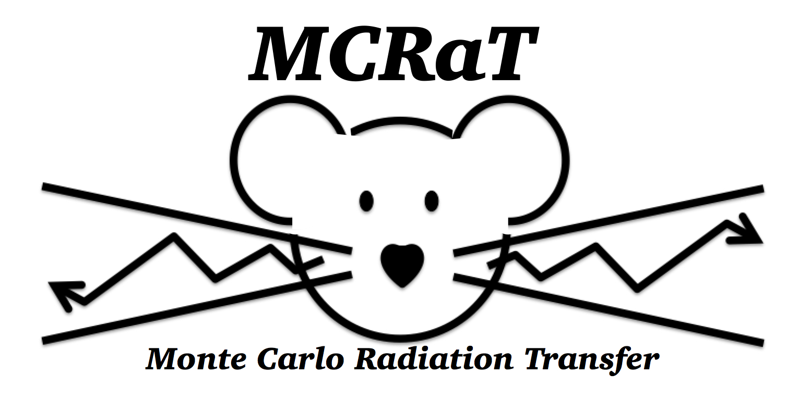

<!--
*** Thanks for checking out the Best-README-Template. If you have a suggestion
*** that would make this better, please fork the repo and create a pull request
*** or simply open an issue with the tag "enhancement".
*** Thanks again! Now go create something AMAZING! :D
***
***
***
*** To avoid retyping too much info. Do a search and replace for the following:
*** lazzati-astro, MCRaT, twitter_handle, email, project_title, project_description
-->


<!-- PROJECT SHIELDS -->
<!--
*** I'm using markdown "reference style" links for readability.
*** Reference links are enclosed in brackets [ ] instead of parentheses ( ).
*** See the bottom of this document for the declaration of the reference variables
*** for contributors-url, forks-url, etc. This is an optional, concise syntax you may use.
*** https://www.markdownguide.org/basic-syntax/#reference-style-links
-->
[![Contributors][contributors-shield]][contributors-url]
[![Forks][forks-shield]][forks-url]
[![Stargazers][stars-shield]][stars-url]
[![Issues][issues-shield]][issues-url]
[![MIT License][license-shield]][license-url]  
[](https://scholar.google.com/citations?user=cIxaj3MAAAAJ&hl=en)
[](https://www.researchgate.net/profile/Tyler-Parsotan)
<a href="https://ascl.net/2005.019"></a>


<!-- PROJECT LOGO -->
<br />
<p align="center">
  <a href="https://github.com/lazzati-astro/MCRaT">
    
  </a>

  <h3 align="center">The MCRaT Code</h3>

  <p align="center">
    MCRaT (pronounced _Em-Cee-Rat_ ) code is a next generation radiation transfer code that can be used to analyze the radiation signature expected from astrophysical outflows. 
    <br />
    <a href="https://github.com/lazzati-astro/MCRaT"><strong>Explore the docs »</strong></a>
    <br />
    <br />
    <a href="https://github.com/lazzati-astro/MCRaT">View Demo</a>
    ·
    <a href="https://github.com/lazzati-astro/MCRaT/issues">Report Bug</a>
    ·
    <a href="https://github.com/lazzati-astro/MCRaT/issues">Request Feature</a>
  </p>
</p>


<!-- TABLE OF CONTENTS -->
<details open="open">
  <summary><h2 style="display: inline-block">Table of Contents</h2></summary>
  <ol>
    <li>
      <a href="#about-the-project">About The Project</a>
      <ul>
        <li><a href="#built-with">Built With</a></li>
      </ul>
    </li>
    <li>
      <a href="#getting-started">Getting Started</a>
      <ul>
        <li><a href="#prerequisites">Prerequisites</a></li>
        <li><a href="#installation">Installation</a></li>
      </ul>
    </li>
    <li><a href="#usage">Usage</a></li>
    <li><a href="#roadmap">Roadmap</a></li>
    <li><a href="#contributing">Contributing</a></li>
    <li><a href="#license">License</a></li>
    <li><a href="#contact">Contact</a></li>
    <li><a href="#acknowledgements">Acknowledgements</a></li>
  </ol>
</details>


<!-- ABOUT THE PROJECT -->
## About The Project

<!-- [![Product Name Screen Shot][product-screenshot]](https://example.com) -->

With advances in simulating astrophysical fluid flows and radiative transfer simulations through the flows, MCRaT represents a next generation radiative transfer simulation that conducts radiative calculations using the background of realistic fluid flow profiles that have been acquired from hydrodynamically simulated outflows. Although MCRaT has primarily been used to study the emission from Gamma Ray Burst jets, it can also be used to study the emission from other astrophysical phenomenon such as jets from Active Galactic Nuclei and Tidal Disruption Events.

MCRaT injects photons into a hydrodynamic simulation of an outflow and calculates the evolution of the trapped radiation within the fluid until the end of the hydrodynamic simulation.  In simulating the raditation, MCRaT takes  a number of physical processes into account including:
* Compton Scattering 
* The Klein–Nishina Cross Section Including the Effects of Polarization
* Cyclo-synchrotron Emission and Absorption

Once the MCRaT calculations have completed, users can construct mock observed light curves, spectra, and polarization measurements from the MCRaT results using the [ProcessMCRaT](https://github.com/parsotat/ProcessMCRaT) libray. 

Currently, MCRaT works with FLASH hydrodynamic simulations and PLUTO AMR simulations, with both 2D spherical (r, ) and 2D cartesian ((x,y) and (r,z)).
<!-- for tex: https://stackoverflow.com/questions/35498525/latex-rendering-in-readme-md-on-github -->

### Built With

* [Message Passing Interface (MPI)](http://www.open-mpi.org/)
* [OpenMP](https://www.openmp.org//)
* [The GNU Scientific Library (GSL)](https://www.gnu.org/software/gsl/)
* [The HDF5 library](https://www.hdfgroup.org/solutions/hdf5/)


<!-- GETTING STARTED -->
## Getting Started

To get a local copy up and running follow these simple steps.

### Prerequisites

This is an example of how to list things you need to use the software and how to install them.
* npm
  ```sh
  npm install npm@latest -g
  ```

### Installation

1. Clone the repo
   ```sh
   git clone https://github.com/lazzati-astro/MCRaT.git
   ```
2. Install NPM packages
   ```sh
   npm install
   ```


<!-- USAGE EXAMPLES -->
## Usage

The video below shows an example of MCRaT scattering photons through a Gamma Ray Burst jet. MCRaT allows us to track the evolution fo the photon spectrum as they photons propagate through the jet and as the jet propagates through space. Additionally, we can keep track of how well the photons are in equilibrium with the matter in the jet, as indicated by the effective temperatures. 

[](https://www.youtube.com/watch?v=pjkAyGUsJro)

There are also python files with documented functions to process the MCRaT output located at: https://github.com/parsotat/ProcessMCRaT.

Use this space to show useful examples of how a project can be used. Additional screenshots, code examples and demos work well in this space. You may also link to more resources.

_For more examples, please refer to the [Documentation](https://github.com/lazzati-astro/MCRaT/Doc)_


<!-- ROADMAP -->
## Roadmap

See the [open issues](https://github.com/lazzati-astro/MCRaT/issues) for a list of proposed features (and known issues).


<!-- CONTRIBUTING -->
## Contributing

Contributions are what make the open source community such an amazing place to be learn, inspire, and create. Any contributions you make are **greatly appreciated**.

1. Fork the Project
2. Create your Feature Branch (`git checkout -b feature/AmazingFeature`)
3. Commit your Changes (`git commit -m 'Add some AmazingFeature'`)
4. Push to the Branch (`git push origin feature/AmazingFeature`)
5. Open a Pull Request


<!-- LICENSE -->
## License

Distributed under the MIT License. See `LICENSE` for more information.


<!-- CONTACT -->
## Contact

Tyler Parsotan - [Personal Website](https://http://sites.science.oregonstate.edu/~parsotat/) - parsotat@oregonstate.edu

Project Link: [https://github.com/lazzati-astro/MCRaT](https://github.com/lazzati-astro/MCRaT)


<!-- ACKNOWLEDGEMENTS -->
## Acknowledgements

* In using MCRaT and the ProcessMCRaT codes, we ask that you cite the following papers: 
    * [Lazzati (2016)](https://doi.org/10.3847/0004-637X/829/2/76)
    * [Parsotan & Lazzati (2018)](https://doi.org/10.3847/1538-4357/aaa087)
    * [Parsotan et al. (2018)](https://doi.org/10.3847/1538-4357/aaeed1)
    * [Parsotan et. al. (2020)](https://doi.org/10.3847/1538-4357/ab910f)
* The code was initially written in python by Dr. Davide Lazzati as a proof of concept. The code was then translated into C by Tyler Parsotan and made to use the OpenMP, MPI, HDF5, and GNU Scientific libraries.
* [README Template from: othneildrew/Best-README-Template](https://github.com/othneildrew/Best-README-Template)


<!-- MARKDOWN LINKS & IMAGES -->
<!-- https://www.markdownguide.org/basic-syntax/#reference-style-links -->
[contributors-shield]: https://img.shields.io/github/contributors/lazzati-astro/MCRaT.svg?style=for-the-badge
[contributors-url]: https://github.com/lazzati-astro/MCRaT/graphs/contributors
[forks-shield]: https://img.shields.io/github/forks/lazzati-astro/MCRaT.svg?style=for-the-badge
[forks-url]: https://github.com/lazzati-astro/MCRaT/network/members
[stars-shield]: https://img.shields.io/github/stars/lazzati-astro/MCRaT.svg?style=for-the-badge
[stars-url]: https://github.com/lazzati-astro/MCRaT/stargazers
[issues-shield]: https://img.shields.io/github/issues/lazzati-astro/MCRaT.svg?style=for-the-badge
[issues-url]: https://github.com/lazzati-astro/MCRaT/issues
[license-shield]: https://img.shields.io/github/license/lazzati-astro/MCRaT.svg?style=for-the-badge
 [license-url]: https://github.com/lazzati-astro/MCRaT/blob/master/LICENSE
<!-- [linkedin-shield]: https://img.shields.io/badge/-LinkedIn-black.svg?style=for-the-badge&logo=linkedin&colorB=555 
[linkedin-url]: https://linkedin.com/in/lazzati-astro -->
